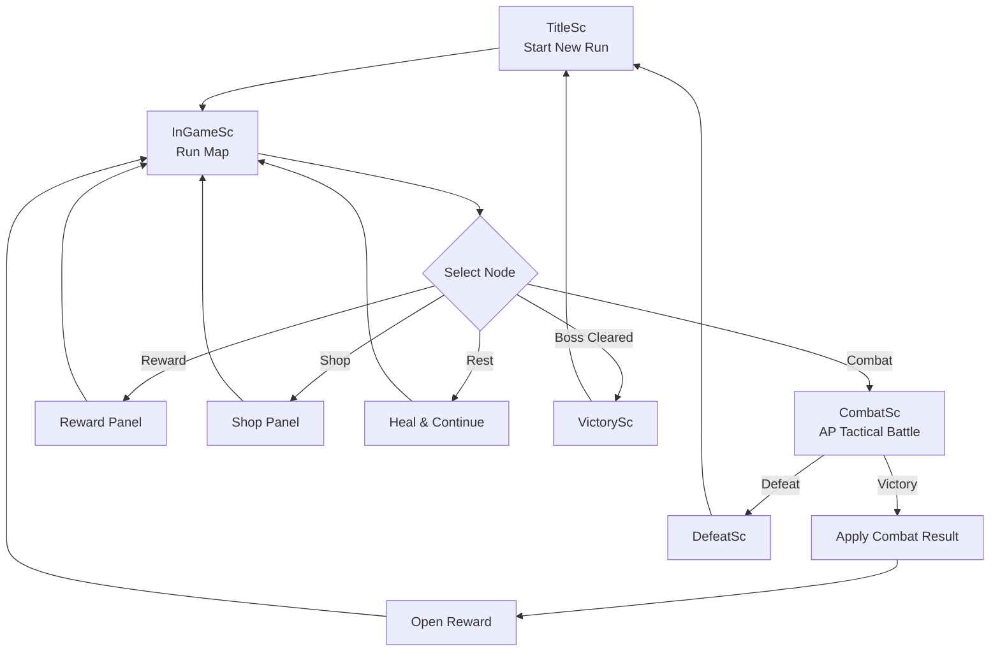
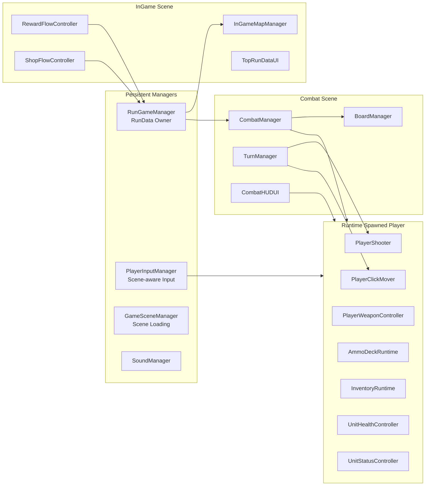

# ProjectRB

> **Top-down turn-based tactical shooter × ammo deckbuilding roguelite**  
> 마우스로 조준하고, AP를 계산하고, 탄약 덱을 굴리며, 매 전투마다 빌드를 성장시키는 Unity 2D 전술 로그라이트 프로토타입입니다.

<p align="left">
  
  
  
  
</p>

---

## 개요

**ProjectRB**는 탑다운 2D 전술 슈팅에 덱빌딩 로그라이트 구조를 결합한 Unity 프로젝트입니다.

일반적인 카드 핸드 기반 전투가 아니라, **탄약 모듈 덱**과 **무기 공격 슬롯**을 중심으로 빌드가 굴러갑니다. 플레이어는 전투 중 AP를 사용해 이동, 조준, 사격, 재장전을 선택하고, 전투 후에는 무기, 탄약, 부착물을 획득하며 다음 노드로 진행합니다.

핵심은 단순합니다.

> **어디로 움직일지, 무엇을 장전할지, 어떤 각도로 쏠지, 다음 전투를 위해 어떤 보상을 고를지.**

---

## 핵심 특징

### Tactical AP Combat

- 플레이어는 매 턴 **3 AP**를 가지고 시작합니다.
- 이동, 사격, 재장전은 AP를 소비합니다.
- 사격 AP 비용은 현재 장착한 무기의 런타임 스탯을 따릅니다.
- 적도 턴을 가지고 순차적으로 행동합니다.

### Mouse Aiming & Raycast Shooting

- 플레이어는 마우스 방향을 바라봅니다.
- 조준선은 장애물에 막히기 전까지의 탄도 경로를 보여줍니다.
- 명중은 단순 타겟 선택이 아니라, 실제 raycast 기반으로 처리됩니다.
- 사거리 판정은 `Optimal / Far / OutOfRange` 밴드 구조를 사용합니다.

### Ammo Module Deckbuilding

- 전투 빌드의 중심은 카드 핸드가 아니라 **탄약 모듈 덱**입니다.
- 재장전 시 덱에서 탄약 모듈을 뽑아 무기 슬롯에 장전합니다.
- 발사된 탄약은 discard pile로 이동합니다.
- draw pile이 비면 discard pile이 다시 섞여 순환됩니다.

### Weapon Runtime & Attachments

- 무기는 현실적인 탄창 수가 아니라 **공격 슬롯**을 사용합니다.
- 한 슬롯은 권총의 단발, 소총의 점사, 저격총의 강한 한 발처럼 “한 번의 공격 사용”을 의미합니다.
- 무기와 부착물은 런타임 상태로 재구성됩니다.
- 부착물은 무기 스탯, 탄약 조건부 효과, 최종 데미지 보정에 영향을 줄 수 있습니다.

### FOV / Stencil Vision

- 정적 원뿔 이미지 대신 raycast 기반 FOV mesh를 사용합니다.
- FOV mesh는 stencil buffer에 시야 영역을 기록합니다.
- 어둠 오버레이는 시야 밖만 덮습니다.
- 적 스프라이트는 stencil 영역 안쪽만 보이도록 렌더링할 수 있습니다.
- 시야 표현과 실제 피격 판정은 분리되어 blind shot이 가능합니다.

### Roguelite Run Flow

- `TitleSc → InGameSc → CombatSc → InGameSc` 구조로 런이 진행됩니다.
- `RunGameManager`가 씬을 넘어 유지되는 run-state를 관리합니다.
- `CombatManager`는 전투 씬에서만 존재하며, `RunData`를 기반으로 전투 런타임을 재구성합니다.
- 노드 기반 맵에서 전투, 보상, 상점, 휴식, 보스 노드를 진행합니다.

---

## Gameplay Loop



---

## System Architecture



---

## 주요 시스템 요약

| System | 역할 |
|---|---|
| `RunGameManager` | 씬 전환 후에도 유지되는 run-state 관리 |
| `CombatManager` | 전투 씬 초기화, 플레이어/적 생성, 승패 처리 |
| `BoardManager` | 방 생성, 타일 데이터, 점유 상태, 이동 가능 여부 관리 |
| `TurnManager` | 플레이어 턴 / 적 턴 / AP 검증 및 소비 관리 |
| `PlayerInputManager` | New Input System 기반 입력 중앙 관리 |
| `PlayerWeaponController` | 2개 무기 슬롯, 현재 무기, 재장전, 무기 런타임 관리 |
| `PlayerShooter` | raycast 사격, 데미지 계산, 탄약 소비, 트레이서 생성 |
| `AmmoDeckRuntime` | draw pile / discard pile / ammo draw / shuffle 관리 |
| `InventoryUIController` | 무기 팝업, 부착물 탭, 덱 상태 탭 등 인벤토리 UI 관리 |
| `RewardFlowController` | 3개 보상 후보 생성, 선택 적용, 무기 교체 처리 |
| `ShopFlowController` | 상점 재고, 구매, 탄약 제거 서비스 처리 |

---

## Controls

| Input | Action |
|---|---|
| `M` | Move preview mode 토글 |
| `Right Mouse Button` | 이동 프리뷰 중에는 이동 시도, 일반 상태에서는 aim-hold 진입 |
| `Left Mouse Button` | aim-hold 중 사격 |
| `1` / `2` | 무기 슬롯 전환 |
| `R` | 현재 무기 재장전 |
| `I` | 인벤토리 열기 / 닫기 |
| `E` | 턴 종료 |
| `Tab` | 일부 씬에서 run map overlay 토글 |

---

## Scenes

| Scene | 설명 |
|---|---|
| `TitleSc` | 새 런 시작 |
| `InGameSc` | 런 맵, 보상, 상점, 휴식 등 진행 관리 |
| `CombatSc` | AP 기반 전술 전투 실행 |
| `VictorySc` | 보스 클리어 후 승리 화면 |
| `DefeatSc` | 플레이어 사망 후 패배 화면 |

---

## 현재 구현 상태

### Working Prototype

- AP 기반 플레이어 턴 구조
- 적 턴 실행 baseline
- 마우스 조준 및 raycast 사격
- 무기별 공격 방식 구분
  - pistol: single shot
  - rifle: sequential burst
  - shotgun: simultaneous pellets
  - sniper: heavy single shot
- 탄약 모듈 draw / load / discard 순환
- 무기 2슬롯 런타임 관리
- 부착물 기반 무기 스탯 변화
- 인벤토리 무기 검사 팝업
- 부착물 / 덱 상태 UI
- 전투 HUD HP / AP / 현재 무기 탄약 큐 표시
- FOV mesh + stencil 기반 시야 표현
- run map 노드 생성 및 진행
- 보상 선택 UI
- 상점 UI, 구매, 탄약 제거 서비스
- 휴식 노드 회복 처리
- 승리 / 패배 씬 전환
- 사운드 / SFX / BGM 임시 작업

### Still In Progress

- 최종 전투 밸런싱
- 적 AI 고도화
- enemy hover 정보 UI
- 사운드 / SFX / BGM 최종 폴리싱
- 저장 / 불러오기
- 최종 아트 패스
- 보상 rarity / weight 조정
- 더 다양한 적, 무기, 탄약, 부착물 콘텐츠
- 투척물 시스템

---

## How to Run

> Unity ver: 6000.3.91f

1. 이 저장소를 clone합니다.

```bash
git clone https://github.com/HyIsty/ProjectRB.git
```

2. Unity Hub에서 프로젝트 폴더를 엽니다.
3. `TitleSc` 씬을 엽니다.
4. Play 버튼을 눌러 실행합니다.

---

## Development Notes

이 프로젝트는 초반부터 “일단 되는 prototype”을 목표로 설계되었습니다.
그래서 구조는 완성형 AAA architecture가 아니라, 다음 원칙을 중심으로 잡혀 있습니다.

- 씬을 넘어 유지할 데이터와 전투 씬에서만 필요한 런타임 데이터를 분리합니다.
- `RunData`는 장기 상태만 저장합니다.
- 전투에 들어갈 때 `CombatManager`가 플레이어 런타임을 재구성합니다.
- 입력은 `PlayerInputManager`가 받고, 실제 행동 실행은 각 gameplay component가 담당합니다.
- 보상, 상점, 휴식은 별도 씬보다 `InGameSc` 위 UI flow로 처리합니다.
- UI raycast blocking 문제를 줄이기 위해 non-interactive graphics는 raycast target을 꺼야 합니다.

---

## Roadmap

- [ ] Enemy AI decision tuning
- [ ] More ammo module effects
- [ ] More weapons and attachments
- [ ] Boss encounter polish
- [ ] Save / load support
- [ ] Final UI art pass
- [ ] Audio polish
- [ ] Balance pass for AP, damage, reload, reward economy
- [ ] Build packaging for Windows PC

---

## License

This project is currently shared for portfolio and learning purposes.  
All rights reserved unless otherwise stated.

---

## 한 줄 요약

**ProjectRB는 탄약 덱을 장전하고, AP를 계산하고, 시야와 엄폐를 읽으며 살아남는 탑다운 턴제 전술 슈팅 로그라이트입니다.**
